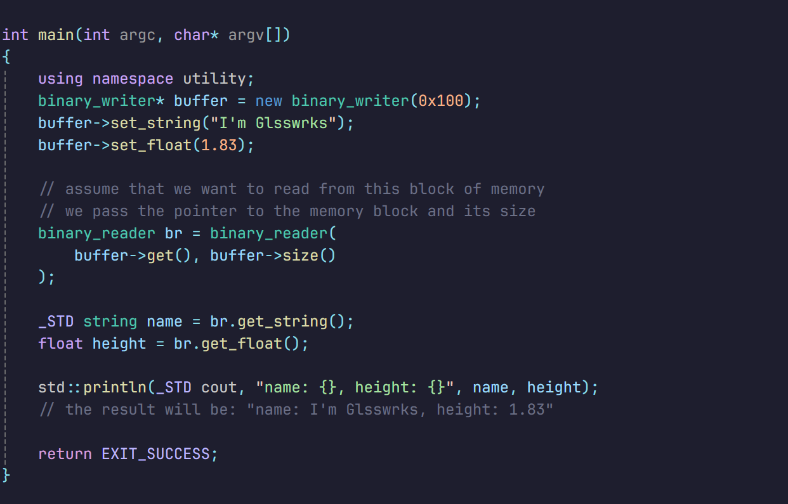

# binary-writer-and-reader
- This is a small project i've created just for fun because i dunno what to do at home, and i'm kinda stressed. You can understand and use it easily because there's no complex task or something in it. i didn't test the code, because i'm lazy, just straight up write it and post it as my first **Github** project. Make an issues if you found any bug or memory-leak.

## + Quick Guide:

**binary writer usage:**

**binary reader usage:**

